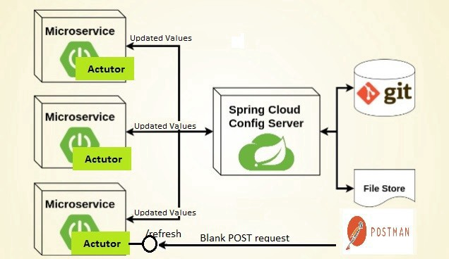
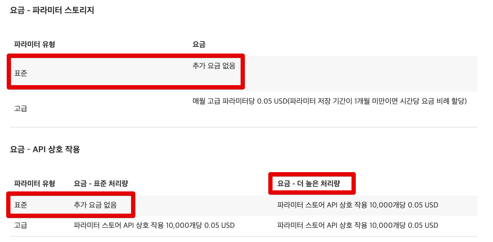

# Spring Boot에서 AWS 파라미터 스토어로 private 설정값 사용하기

이를 테면 DB의 접속정보나 암호화에 사용될 Salt Key 등은 프로젝트 코드 내부에서 관리하기엔 위험이 따릅니다.  
누구나 볼 수 있기 때문이죠.  

> 이건 사내 private 저장소를 사용해도 비슷합니다.  
> 사내의 누구나 이 설정값을 확인할 수 있다면 위험하다고 보안 감사에서 지적 받을 수 있습니다.
  
그래서 실제 운영 환경에서는 이런 주요 설정들은 **프로젝트 코드 밖에서** 관리되는데요.  
가장 흔한 방법은 서버에 직접 파일을 저장해서 사용하는 것입니다.  
  
하지만 최근처럼 클라우드 환경이 대세인 상황에서는 **동적으로 서버가 추가/삭제가 되는 상황**에서는 서버에서 직접 파일 관리하기에는 어려움이 많습니다.  
  
그래서 이에 대해서 외부에서 설정 정보를 관리하고, 애플리케이션에서는 해당 설정정보를 받아서 쓰는 방식이 선호되고 있는데요.  
  
대표적으로는 [버전 관리 기반의 Spring Cloud Config](https://cloud.spring.io/spring-cloud-config/reference/html/)가 있습니다.  
  

(이미지 출처: [microservices-centralized-configuration-with-spring-cloud-f2a1f7b78cc2](https://medium.com/@ijayakantha/microservices-centralized-configuration-with-spring-cloud-f2a1f7b78cc2))

아무래도 국내에서 가장 많이 공유된 방법이다보니 위와 같은 이슈에서 가장 먼저 선호되는 방법일텐데요.  
당장 급하게 도입해야하거나 관리될 데이터가 아주 소수일 때 사용하기엔 적절하지 않을 수도 있습니다.  
  
1~2개의 설정값을 관리하기 위해 별도의 Config 서버를 구축 (베타/운영 환경 둘다) 하고, 추가적인 Git Repository를 생성하는 등의 과정이 상황에 따라서 과하게 느껴질 수 있는데요.  
  
[[ad]]

이럴때 사용하기 좋은게 AWS에서 제공하는 파라미터 스토어입니다.  
  
AWS의 파라미터 스토어는 AWS에서 원격 설정값을 제공하는 서비스이며, 이에 대한 사용 방법은 이미 Spring Cloud에서 spring-cloud-starter-aws-parameter-store-config 로 지원해주고 있으니 적용하기에 아주 쉽습니다.  

> 모든 코드는 [Github](https://github.com/jojoldu/spring-boot-aws)에 있습니다.

## 

[요금표](https://aws.amazon.com/ko/systems-manager/pricing/)

동적 파라미터로 사용하는게 아니라, **처음 부트 실행시에만 한번 불러오는 구조**