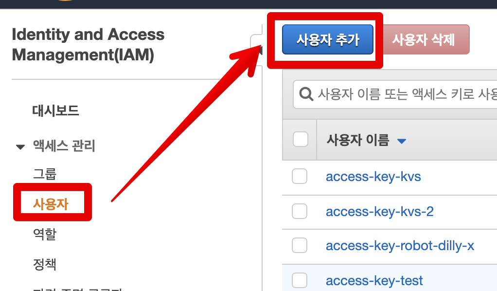
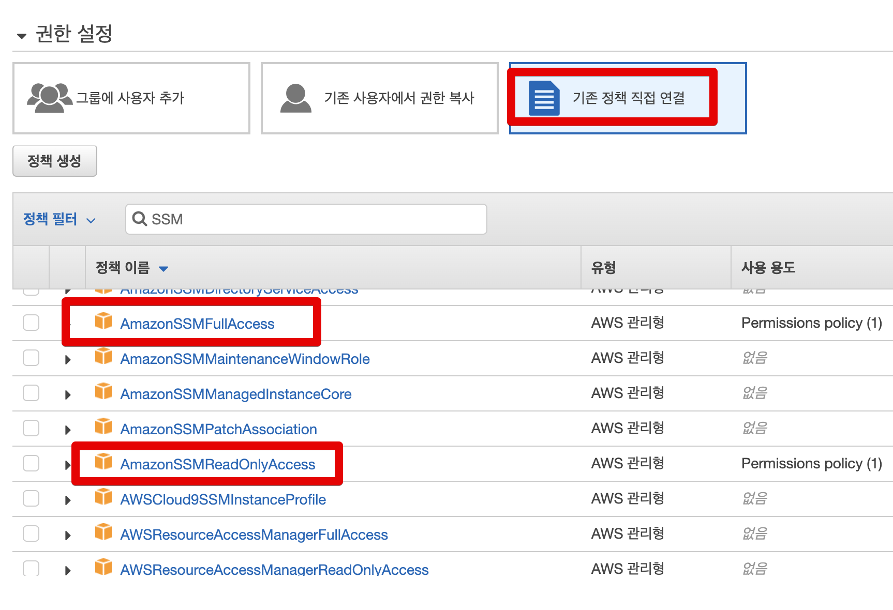
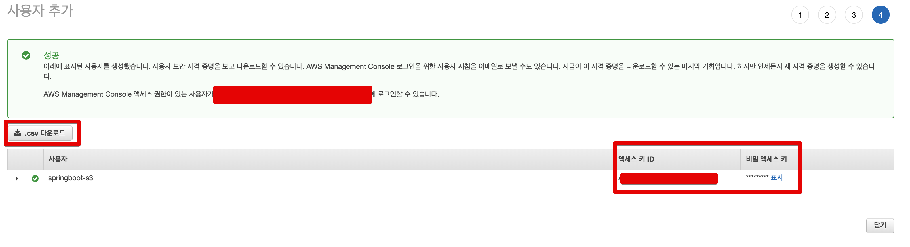
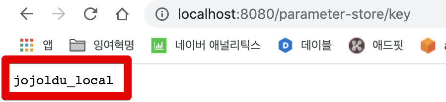
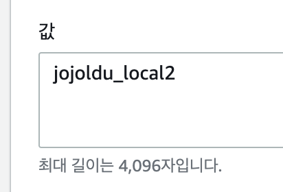
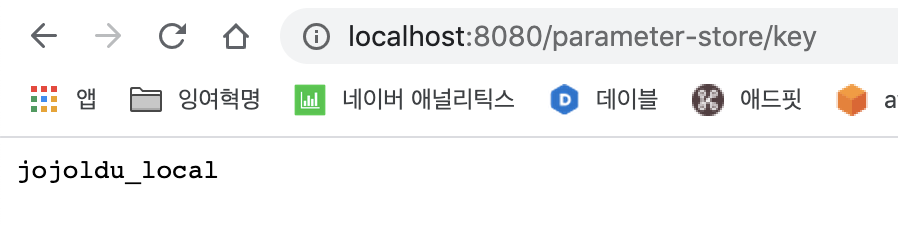
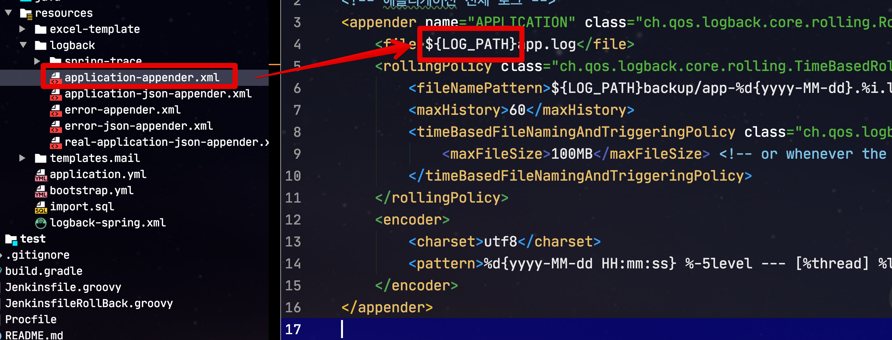
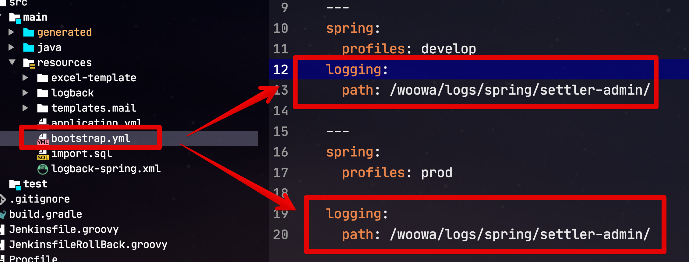

# Spring Boot에서 AWS 파라미터 스토어로 private 설정값 사용하기

이를 테면 DB의 접속정보나 암호화에 사용될 Salt Key 등은 프로젝트 코드 내부에서 관리하기엔 위험이 따릅니다.  
누구나 볼 수 있기 때문이죠.  

> 이건 사내 private 저장소를 사용해도 비슷합니다.  
> 사내의 누구나 이 설정값을 확인할 수 있다면 위험하다고 보안 감사에서 지적 받을 수 있습니다.
  
그래서 실제 운영 환경에서는 이런 주요 설정들은 **프로젝트 코드 밖에서** 관리되는데요.  
가장 흔한 방법은 서버에 직접 파일을 저장해서 사용하는 것입니다.  
  
하지만 최근처럼 클라우드 환경이 대세인 상황에서는 **동적으로 서버가 추가/삭제가 되는 상황**에서는 서버에서 직접 파일 관리하기에는 어려움이 많습니다.  
  
그래서 이에 대해서 외부에서 설정 정보를 관리하고, 애플리케이션에서는 해당 설정정보를 받아서 쓰는 방식이 선호되고 있는데요.  
  
대표적으로는 [버전 관리 기반의 Spring Cloud Config](https://cloud.spring.io/spring-cloud-config/reference/html/)가 있습니다.  
  


(이미지 출처: [microservices-centralized-configuration-with-spring-cloud-f2a1f7b78cc2](https://medium.com/@ijayakantha/microservices-centralized-configuration-with-spring-cloud-f2a1f7b78cc2))

아무래도 국내에서 가장 많이 공유된 방법이다보니 위와 같은 이슈에서 가장 먼저 선호되는 방법일텐데요.  
당장 급하게 도입해야하거나 관리될 데이터가 아주 소수일 때 사용하기엔 적절하지 않을 수도 있습니다.  
  
1~2개의 설정값을 관리하기 위해 별도의 Config 서버를 구축 (베타/운영 환경 둘다) 하고, 추가적인 Git Repository를 생성하는 등의 과정이 상황에 따라서 과하게 느껴질 수 있는데요.  
  
[[ad]]

이럴때 사용하기 좋은게 AWS에서 제공하는 파라미터 스토어입니다.  
  
AWS의 파라미터 스토어는 AWS에서 원격 설정값을 제공하는 서비스이며, 이에 대한 사용 방법은 이미 Spring Cloud에서 spring-cloud-starter-aws-parameter-store-config 로 지원해주고 있으니 적용하기에 아주 쉽습니다.  

> 모든 코드는 [Github](https://github.com/jojoldu/spring-boot-aws)에 있습니다.

AWS 파라미터 스터오는 **표준 파라미터, Limit 해제를 하지 않는 상태** 라면 무료로 사용 가능합니다.


* [요금표](https://aws.amazon.com/ko/systems-manager/pricing/)

그래서 실제로 Spring Boot 배포시에만 적용된다면 비용 관계 없이 편하게 이용하실 수 있으실것 같습니다.  
  
자 그럼 실제 프로젝트에 한번 적용해보겠습니다.

## 1. 적용하기

### 1-1. 프로젝트 설정

기존의 Spring Cloud 프로젝트에 다음의 의존성을 추가합니다.

```groovy
dependencies {
    ...
    implementation 'org.springframework.cloud:spring-cloud-starter-aws-parameter-store-config'
}
```


만약 Spring Cloud Dependency가 없다면 아래와 같이 추가해줍니다.

```groovy
ext {
    set('springCloudVersion', "Hoxton.SR6")
}

...

dependencyManagement {
    imports {
        mavenBom "org.springframework.cloud:spring-cloud-dependencies:${springCloudVersion}"
    }
}
```

* springCloudVersion 버전은 본인 프로젝트의 Spring Boot 버전에 맞춰 설정하시면 됩니다.

추가 되셨다면 ```src/main/resourece``` 아래에 ```bootstrap.yml``` 파일을 생성하여 추가합니다.  
spring-cloud-starter-aws-parameter-store-config 에서의 설정 값은 기존의 다른 설정들처럼 ```application.yml```을 사용하지 않고, ```bootstrap.yml``` 을 사용합니다.  


설정은 아래와 같습니다.

```yml
aws:
  paramstore:
    enabled: true
    prefix: /spring-boot-aws
    name: cloud-parameter-store
    profileSeparator: _
```

* ```enabled``` 
  * 파라미터 스토어 설정 ON
* ```prefix```
  * 파라미터 스토어의 Key 값 가장 첫번째 구분용
  * ```/aaa/bbb/ccc``` 와 같은 구조에서 ```/aaa```를 담당 
* ```name```
  * Key의 두번째 구분용
  * ```/aaa/bbb/ccc``` 와 같은 구조에서 ```/bbb```를 담당
  * 바로 하단의 ```profileSeparator``` 와 함께 사용 가능
* ```profileSeparator```
  * 바로 위 name과 함께 사용될 **profile 구분자**
  * ex: 파라미터 스토어의 Key가 ```/aaa/bbb_local/ccc``` 가 있다면, ```profileSeparator```가 ```_``` 이며, 현재 Spring Boot 애플리케이션 profile이 ```local``` 일 경우 값을 호출할 수 있다. 
* ```failFast```
  * 기본값: ```true```
  * 파라미터 스토어에서 값을 못 읽었을때 어떻게 할지를 결정하는 옵션
  * true이면 애플리케이션 실행을 못하도록 한다. (즉, 파라미터 스토어 값을 못 읽어도 애플리케이션 실행을 원하면 ```false```로 둔다)

[[ad]]

파라미터 스토어 사용은 위와 같은 설정이면 끝납니다.  
실제 설정값을 사용하는 클래스를 만들어보면

```java
@Getter
@Setter
@NoArgsConstructor
@Configuration
public class ParameterStoreProperties {

    @Value("${encrypt.key}") // (1)
    private String encryptKey;
}
```

(1) ```@Value("${encrypt.key}")```

* 파라미터 스토어의 ```/aaa/bbb/ccc``` 구조에서 ```/ccc```를 담당

코드로 작성해야할 부분은 모두 끝났습니다.  
그럼 이제 AWS 페이지로 이동해 파라미터를 생성해보겠습니다.

### 1-2. 파라미터 스토어 설정

AWS 서비스 검색에서 System Manager를 검색합니다.  
(파라미터 스토어가 System Manager 하위에 위치합니다.)


사이드바의 Parameter Store -> 파라미터로 이동합니다.


파라미터 생성 버튼을 클릭 하신뒤 아래와 같이 각 항목을 입력하시면 되는데요.


* 이름
  * 이름은 다음 규칙을 따라갑니다.
  * ```{prefix}/{name}{profileSeparator}{profile}/parameter.key```
  * 위 캡쳐로 본다면 prefix: ```/spring-boot-aws```, name: ```cloud-parameter-store```, parameter.key: ```encrypt.key```가 됩니다.
* 유형
  * 보안 문자열: 파라미터 값이 암호화 되어 관리 됩니다.
* 값
  * 파라미터로 관리되길 원하는 값을 등록합니다.

여기서 만약 profile (```real```) 항목까지 포함해서 생성한다면 다음과 같이 됩니다.


기본값/local/real이 모두 포함된다면 아래와 같이 됩니다.


name에 해당하는 ```cloud-parameter-store``` 뒤에 profileSeparator인 ```_``` (1-1에서 지정한 bootstrap.yml 참고) 를 두고, profile (```local, real```) 을 추가로 붙입니다.  
  
이렇게 할 경우 Spring Boot profile과 파라미터 스토어의 관계는 다음과 같이 됩니다.

* active profile이 없을 경우 ```cloud-parameter-store```
* active profile이 local일 경우 ```cloud-parameter-store_local```
* active profile이 real일 경우 ```cloud-parameter-store_real```

현재 본인 프로젝트의 profile에 맞춰 이름을 생성합니다.  
  
제일 하단에 있는 값이 바로 위 이름에 맞춰 호출될 값이 됩니다.  
저는 테스트용도로 ```jojoldu```로 채웠습니다.


생성이 되셨다면 아래와 같이 확인해볼 수 있습니다.


유형을 보안 문자열로 했기 때문에 값이 **마스킹** 되어있는 것을 확인할 수 있습니다.


자 그럼 이제 잘 설정되었는지 테스트 해보겠습니다.

## 2. 테스트

위에서 설정한 코드를 실제 테스트해볼 예정입니다.  
다만 배포까지 해서 보기보다는, 로컬에서 바로 확인해보겠습니다.

### 2-1. IAM User 발급

만약 EC2에 배포할때만 쓴다면 EC2에 할당된 IAM Role에만 SSM 권한을 추가하면 되겠지만, 로컬 PC에서 테스트 할때는 AWS를 사용할 수 있는 Key를 발급 받아야만 합니다.  
  
이미 있으신 분들은 바로 2-2로 넘어가시면 됩니다.  
  
먼저 IAM 페이지로 이동 하신뒤 사용자 추가로 넘어갑니다.



권한에는 기존 정책 직접 연결 -> SSM 권한 체크를 하시면 되는데요.



딱 조회에만 사용할 Key를 발급 받으신다면 ReadOnlyAccess를, 조회 외에 여러가지를 다 제어하실려면 FullAccess 를 체크하시면 됩니다.  
  
생성이 끝나시면 아래와 같이 access_key_id와 secret_access_key가 생성 됩니다.



이 Key들을 **본인의 로컬 PC에 설치**합니다.  

> 이 예제는 모두 Unix 기반 시스템 (MacOS, Linux) 를 기준으로 합니다.  
> 윈도우에서의 설정 방법은 [공식 문서](https://docs.aws.amazon.com/ko_kr/cli/latest/userguide/cli-configure-files.html)를 참고해주세요.

아래 명령어로 설정 파일을 열어서

```bash
vim ~/.aws/credentials
```

Key 값들을 아래 양식으로 등록합니다.

```bash
[default]
aws_access_key_id=생성된 access_key_id 
aws_secret_access_key=생성된 secret_access_key
```

그리고 Key외에 추가정보들은 아래 설정 파일에서 등록합니다.

```bash
vim ~/.aws/config
```

저는 서울 리전(ap-northeast-2)을 사용중이라 아래와 같이 등록합니다.

```bash
[default]
region=ap-northeast-2
output=json
```

Key 설정이 다 되셨다면 이제 검증해볼 테스트 코드를 작성해보겠습니다.

### 2-2. 테스트 코드

[[ad]]

테스트해볼 테스트 코드는 아래와 같습니다.

```java
@ExtendWith(SpringExtension.class)
@SpringBootTest
public class ParameterStorePropertiesTest {

    @Autowired
    private ParameterStoreProperties properties;

    @Test
    void local_파라미터를_가져온다() throws Exception {
        assertThat(properties.getEncryptKey()).isEqualTo("jojoldu_local");
    }
}
```

* 제 프로젝트는 테스트 실행시 active profile을 ```local```로 두었는데, 혹시나 다른 profile이 active되신다면 그에 맞게 검증값을 변경해주시면 됩니다.
* ```ParameterStoreProperties``` 는 1-1에서 만들었습니다.

위 테스트 코드를 돌려보면?


정상적으로 AWS 파라미터 스토어에 있는 값을 가져오는것을 확인할 수 있습니다.

## 3. 동적 파라미터?

AWS 파라미터 스토어를 이용한 방식에선 Spring Cloud Config에 비해 안되는 기능이 있는데요.  
**동적 파라미터**가 안됩니다.  
즉, 처음 Spring Boot Application이 실행될때만 한번 파라미터를 가져오며, 이후에는 실시간으로 가져오지 않습니다.  
  
간단하게 테스트 해보면 아래처럼 파라미터 스토어 값을 반환하는 API를 만들어 봅니다.

```java
@RequiredArgsConstructor
@RestController
public class ParameterStoreController {
    private final ParameterStoreProperties properties;

    @GetMapping("/parameter-store/key")
    public String getKey() {
        return properties.getEncryptKey();
    }
}
```

호출해보면 아래와 같이 ```jojoldu_local``` 이란 값이 노출 되는데요.  



**Spring Application을 종료하지 않은 채** 파라미터 스토어에 있는 값만 변경해서



다시 호출해보면?  



**변경된 값이 반영되지 않는 것**을 확인할 수 있습니다.  
  
그래서 혹시나 동적 파라미터가 필요하다면 Spring Cloud Config 혹은 DB에 적재해서 사용하시는 방법을 고민하시는게 좋을것 같습니다.

## 4. 주의사항

만약 위 설정을 마친뒤 배포를 진행했을때 아래와 같이 **로그 설정 관련 오류**가 발생한다면 아래 설정을 참고해 고치면 된다.

```bash
LOG_PATH_IS_UNDEFINED/
```

아마도 본인 프로젝트의 로그 설정이 아래와 같이 ```${LOG_PATH}``` 로 되어있을 것이다.  
이 설정은 application.yml (혹은 application.properties) 에 등록된 ```logging.path``` 를 변수로 가져오는 것을 의미하는데, 이게 spring-cloud-starter-aws-parameter-store-config 의존성이 들어가면 제대로 사용되지 못한다.



그래서 위 로깅 설정 (```logging.path```) 을 application.yml에서 **bootstrap.yml**로 옮기면 정상 작동하게 된다.

